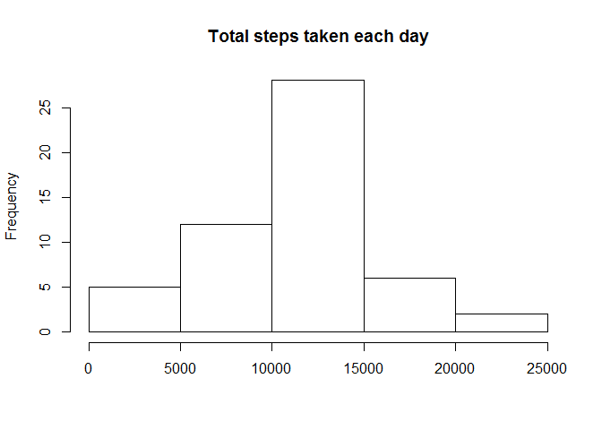
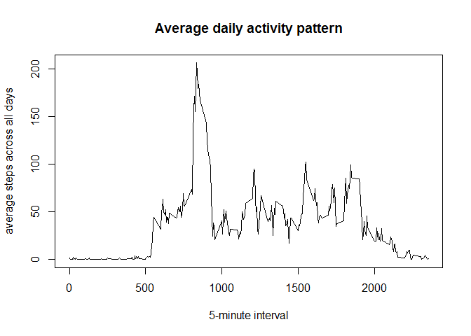
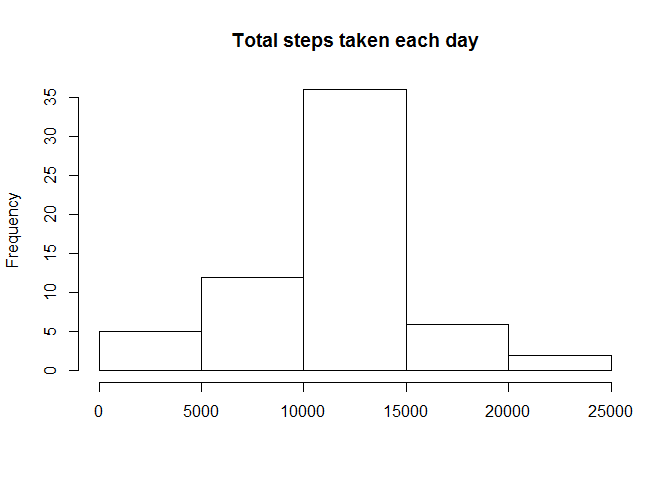

# Reproducible Research: Peer Assessment 1


**Loading and preprocessing the data**

```r
activity1 <- unzip("C:/Users/sony/Documents/R/RepData_PeerAssessment1/activity.zip")
```


```r
activity <- read.csv(activity1, colClasses=c("numeric", "character", "numeric"))
```


```r
activity$date <- as.Date(activity$date, "%Y-%m-%d")
```


#### What is mean total number of steps taken per day? 

*Calculate steps per day*

```r
stepsperday <- aggregate(steps ~ date, activity, sum)
```

*Calculate mean and median of steps per day*


```r
mean_steps <- mean(stepsperday$steps)
median_steps <- median(stepsperday$steps)
mean_steps
```

```
## [1] 10766.19
```

```r
median_steps
```

```
## [1] 10765
```

**Histogram**


```r
hist(stepsperday$steps, ylab="Frequency", xlab = "", main="Total steps taken each day")
```

 

#### What is the average daily activity pattern?

**Daily activity pattern**


```r
avg_steps_interval <- aggregate(steps ~ interval, activity, mean)
plot(avg_steps_interval$interval, avg_steps_interval$steps, type="l", xlab="5-minute interval", ylab= "average steps across all days", main= "Average daily activity pattern")
```

 

**Calculating interval that has maximum number of steps**


```r
max_interval <- avg_steps_interval[which.max(avg_steps_interval$steps),]
max_interval
```

```
##     interval    steps
## 104      835 206.1698
```

#### Imputing missing values

*Calculate total missing values*


```r
Total_missing <- sum(is.na(activity))
Total_missing
```

```
## [1] 2304
```

*Filling in all of the missing values in the dataset and create a new dataset that is equal to the original dataset but with the missing data filled in.*


```r
imp_activity <- lapply(activity, function(x) { 
  x[is.na(x)] <- mean(x, na.rm = TRUE)
  x
})
```

*Calculating steps per day for revised dataset*


```r
stepsperday1 <- aggregate(steps ~ date, imp_activity, sum)
```

*Make a histogram of the total number of steps taken each day using revised dataset*


```r
hist(stepsperday1$steps, ylab="Frequency", xlab = "", main="Total steps taken each day")
```

 

*Calculate and report the mean and median total number of steps taken per day*


```r
mean_steps1 <- mean(stepsperday1$steps)
median_steps1 <- median(stepsperday1$steps)
mean_steps1
```

```
## [1] 10766.19
```

```r
median_steps1
```

```
## [1] 10766.19
```

*Do these values differ from the estimates from the first part of the assignment?*


```r
comp_mean <- mean_steps == mean_steps1
comp_median <- median_steps == median_steps1
comp_mean
```

```
## [1] TRUE
```

```r
comp_median
```

```
## [1] FALSE
```

**What is the impact of imputing missing data on the estimates of the total daily number of steps?**

The mean of original dataset and revised dataset after imputation are equal while the medians are slightly different. Post imputation, the sum of steps per day are higher. Accordingly, the peak of histogram is higher in the revised dataset. 


#### Are there differences in activity patterns between weekdays and weekends?

*Create a new factor variable in the dataset with two levels - "weekday" and "weekend" indicating whether a given date is a weekday or weekend day.*


```r
type_day <- function(date) {
  if (weekdays(as.Date(date)) %in% c("Saturday", "Sunday")) {
    "weekend"
  } else {
    "weekday"
  }
}
imp_activity$type_day <- as.factor(sapply(imp_activity$date, type_day))
```

**Make a panel plot containing a time series plot (i.e. type = "l") of the 5-minute interval (x-axis) and the average number of steps taken, averaged across all weekday days or weekend days (y-axis)**


```r
avg_steps_interval1 <- aggregate(steps ~ interval + type_day, data=imp_activity, mean)
library(lattice)
xyplot(steps ~ interval | type_day, avg_steps_interval1, type = "l", layout = c(1, 2), 
  xlab = "Interval", ylab = "Number of steps")
```

 
